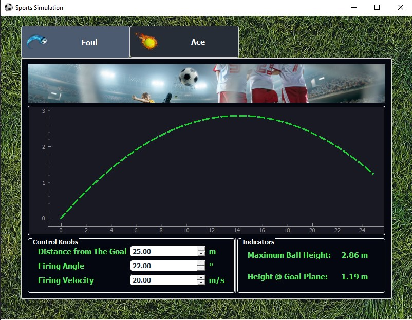
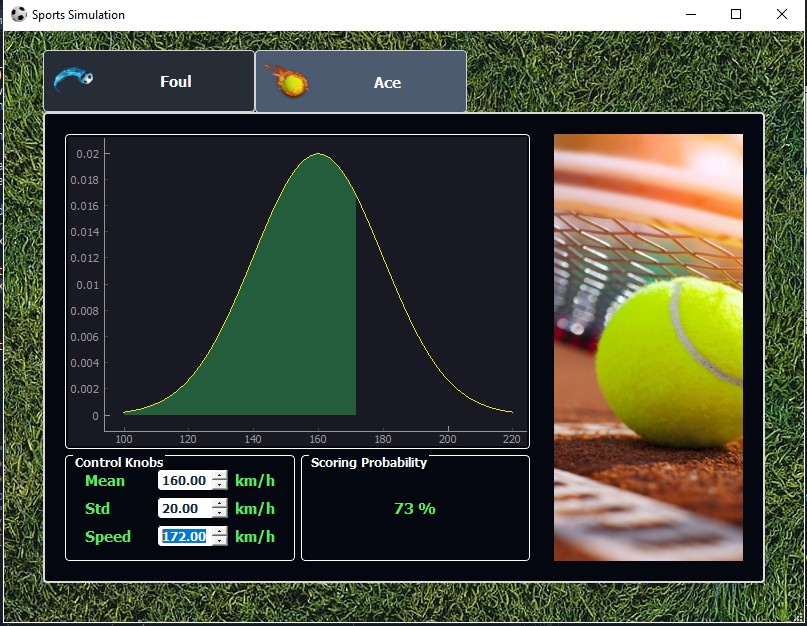

# Sports Simulation 

A python based application that simulates two scenarios from two different kinds of sports, soccer fouls and tennis aces. Having each sport in a different tab, we implemented dynamic graphs to visually demonstrate the simulations in both conditions.
____________________
<br>

## Controls
<br>

### Free Kick
The foul simulation is controlled using three parameters; *`distance from the goal`*, the *`firing angle`* and the *`firing velocity`*, through which we get the *`maximum height`* of the ball and the *`height at the goal plane`*. It's important to note the we neglected drag forces and assumed the the shooting spots are as much as possible perpendicular to the goal line.
> Samples `1` 

<br>

### Ace
For the ace simulation, the purpose was to calculate the player's chance to make an Ace (a service which cannot not be returned by 
the opponent), knowing that it increases with an increasing ball hitting *`speed`*. Having that in mind, we considered that this chance obeys cumulative Gaussian probability distribution of the ball hit speed with a *`mean`* set to a default of `160 km/h` and a *`standard deviation`* with a default of `20 km/h`.
> Samples `2` and `3`

<br><br>

## Samples

<p align="center"><br>
    <br><br>
</P>

<p align="center"><br>
    <br><br>
</P>

<p align="center"><br>
    <br><br>
</P><br>

## Tools 
* Python 
* PyQt

<br><br>

## Code Snippets
The Ace chance function in a simplified form
```py
def score_probability(self):

        mu = self.doubleSpinBox_mu.value()
        std = self.doubleSpinBox_std.value()
        speed = self.doubleSpinBox_spd.value()
        
        x = np.linspace(mu - 3*std, mu + 3*std, int(6*std))
        self.graphicsView_normal.clear()
        self.graphicsView_normal.plot(x, norm.pdf(x, mu, std))
    
        cdf = norm.cdf(speed, loc=mu, scale=std)
```

____________________
<br>

## Contributors 
Name | Github 
------|----------
Ahmed Wael | Ahmedwael-afk
Doaa Salah |  
Mohamed Osama | osama51
Mohamed Abdel Galeel | 


